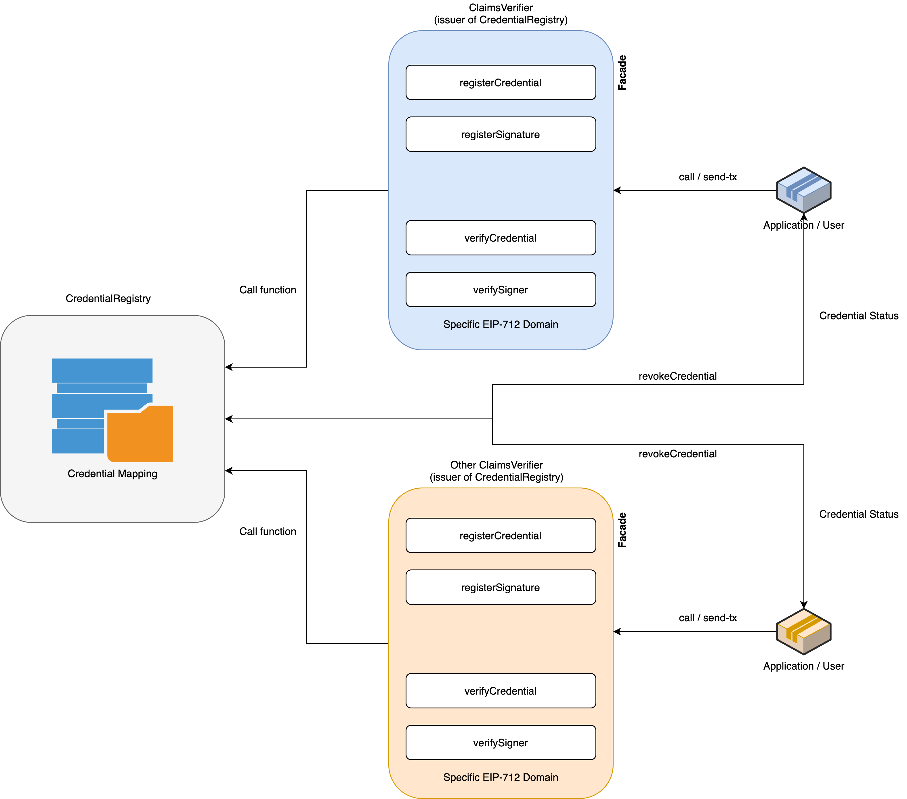

## Introduction
In this repository are the smart contracts based on [EIP-712](https://eips.ethereum.org/EIPS/eip-712) and [EIP-1812](https://eips.ethereum.org/EIPS/eip-1812) for Structured Data Types and Verifiable Claims respectively, to perform the registration and verification process of [Verifiable Credentials](https://www.w3.org/TR/vc-data-model/) on-chain.

### Structure



The main objective is to have a global credential repository that works in a generic way for any type of Verifiable Credential. 
That is why within the contracts there is the **CredentialRegistry** whose function is to maintain the main registry. However, it is not intended to interact directly with applications. 
That is why there is a contract that serves as a Facade to be able to register each type of credential, this contract is called **ClaimsVerifier**, and it is in charge of both registering the credential hashes and verifying them by making internal calls to the **CredentialRegistry**.

- **CredentialRegistry**: Master credential registry
- **AbstractClaimsVerifier**: Abstract class that represents a credential verifier
- **ClaimsVerifier**: Class that allows verifying a specific type of credential (inherits from **AbstractClaimVerifier**). Receive the **CredentialRegistry** address as a constructor argument
- **ClaimTypes**: Generic class that defines EIP712 domain types for credentials
- **ICredentialRegistry**: Interface that defines the main methods of a **CredentialRegistry**, as well as the metadata of each credential
- **Migrations**: Truffle deployment control class

### Security roles

The contracts make use of the [OpenZeppelin Access Control System](https://docs.openzeppelin.com/contracts/2.x/access-control), for which 2 roles have been defined:

- **ISSUER_ROLE**: 0x114e74f6ea3bd819998f78687bfcb11b140da08e9b7d222fa9c1f1ba1f2aa122 
- **SIGNER_ROLE**: 0xe2f4eaae4a9751e85a3e4a7b9587827a877f29914755229b07a7b2da98285f70

The **ISSUER_ROLE** should be assigned to any account that is going to register a credential in the **ClaimsVerifier** contract.

The **SIGNER_ROLE** should be assigned to any account that is going to sign a credential within the **ClaimsVerifier** contract. 

***Note**: The issuer does not count as a signer, since by default the signer will send his signature when registering the credential*.

There is an additional use of the **ISSUER_ROLE**, and that in order to interact with the **CredentialRegistry**, the **ClaimsVerifier** contract address must be registered as an issuer in the **CredentialRegistry**. The latter makes more sense when considering that there will be different types of credentials and therefore Claims Verifiers.

## Usage

### 1. Register a credential
The process to register a new credential consists of store the hash of the credential, in this way no information is compromised.
To generate the credential hash is used the [EIP-1812 Verifiable Claims](https://eips.ethereum.org/EIPS/eip-1812#claims-data-structure), with the following data structure:

```solidity
struct VerifiableCredential {
    address issuer;
    address subject;
    bytes32 data;
    uint256 validFrom;
    uint256 validTo;
}
```

Where ``data`` should be the SHA-256 of **credentialSubject** of a Verifiable Credential (but it can be the hash of any property of the credential).

And the [EIP-712 Domain](https://eips.ethereum.org/EIPS/eip-712#signatures-and-hashing-overview) is:

```solidity
EIP712Domain(string name,string version,uint256 chainId,address verifyingContract)
```

Where:

 - name: The sha3 of string "EIP712Domain"
 - version: The sha3 of number 1
 - chainId: The network id (In L-net is 648529)
 - verifyingContract: The address of **ClaimsVerifier** contract

As mentioned in the Structure section, the contract to register a credential is **ClaimsVerifier**, and the function to do this is:

```solidity
function registerCredential(address _subject, bytes32 _credentialHash, uint256 _from, uint256 _exp, bytes calldata _signature)
```

Where:
 - **_subject**: It is the address of the subject
 - **_credentialHash**: It is the previously generated hash
 - **_from**: It is the emission timestamp (in seconds)
 - **_exp**: It is the expiration timestamp (in seconds)
 - **_signature**: It is issuer signature in hex format

The issuer signature is just the result of [eth_signTypedData](https://eips.ethereum.org/EIPS/eip-712#signatures-and-hashing-overview) function applied to the credential hash using the private key of issuer.

#### Register an additional signature

In order to register an additional signature to a credential it is only necessary to invoke the corresponding function in the **ClaimsVerifier** contract:

```solidity
function registerSignature(bytes32 _credentialHash, address issuer, bytes calldata _signature)
```

Where:
- **_credentialHash**: It is the previously generated hash
- **_signature**: It is the additional signer signature in hex (same procedure as issuer signature)

### 2. Verify the credential
Unlike the registration methods, the function to verify a credential can only be called without the need to send a transaction to the network, therefore it has zero gas cost. 
The function to verify a credential is inside **ClaimsVerifier** and is the following:

```solidity
function verifyCredential(VerifiableCredential memory vc, uint8 v, bytes32 r, bytes32 s) public view returns (bool, bool, bool, bool, bool)
```

Where:
- **vc**: It is the VerifiableCredential structure
- **v, r, s**: Are the [Components of the EDSA signature](http://www.secg.org/sec1-v2.pdf) of the issuer 

The result of verification is a 5-tuple for the following validations (in order):
1. If the credential exists (if it is registered)
2. If is not revoked
3. If the issuer signature is correct
4. If has the number of additional signatures
5. If has not expired

#### Verify the additional signature

The ``verifyCredential`` function only validates that the number of additional signatures is equal to the number of registered signers. To verify that each of the extra signatures are correct, you need to call the following function (inside **ClaimsVerifier*):

```solidity
function verifySigner(VerifiableCredential memory vc, bytes calldata _signature) public view returns (bool)
```
Where:
- **vc**: It is the VerifiableCredential structure
- **_signature**: Are the signature of the signer in hex format

The result is only a boolean if the signature is correct.

### 3. Revocation
As shown in the structure diagram, the process of revocation of a credential must be called directly in the **CredentialRegistry** contract, that is because this function validates that only the issuer can execute this operation (since if the facade is used, the ``msg.sender`` would be the address of the **ClaimVerifier**).

```solidity
function revokeCredential(bytes32 _credentialHash)
```

Where:
- **_credentialHash**: It is the generated credential hash

This function will revoke the credential associated to the ``msg.sender`` and the ``_credentialHash``.

#### Verify the credential status (Revocation List)

Taking advantage of the fact that the **CredentialRegistry** maintains the revocation status of any credential regardless of the type, we have decided to implement a method to verify this information using this same contract, as follows:

```solidity
function status(address issuer, bytes32 _credentialHash) external view returns (bool)
```

Where:
- **issuer**: It is the issuer address
- **_credentialHash**: It is the generated credential hash

This information could be used to define the ``credentialStatus`` of a Verifiable Credential.

```json
"credentialStatus": {
    "id": "<CREDENTIAL_REGISTRY_ADDRESS>",
    "type": "SmartContract"
}
```

## Credential Examples

To show some examples of generated Verifiable Credentials are in this same repository.

1. [Academic Certificate](./examples/academic.json). An example of VC for academic diplomas, specifically for the LACChain Academy course.
2. [Vaccination Credential](./examples/vaccination.json). An example of VC that certifies a vaccinated person.

## Deploy contracts

### Pre-requisites

- NodeJS  > 12.4
- OpenZeppelin CLI > 2.8.2
- OpenZeppelin Contracts @ 3.0.0

1. Initialize OpenZeppelin project
```
$ oz init
```

2. Deploy **CredentialRegistry**
```
$ oz deploy
```

3. Deploy **ClaimsVerifier** using the **CredentialRegistry** address as init argument
```
$ oz deploy
```

4. Assign **ClaimsVerifier** address as **ISSUER_ROLE** to the **CredentialRegistry** using the ```grantRole``` function
```
$ oz send-tx
```

5. Assign the **ISSUER_ROLE** and **SIGNER_ROLE** to the corresponding address accounts in the **ClaimsVerifier** contract using the grantRole function
```
$ oz send-tx
```

## Testing

```
$ npm install
$ npm test
```


### Using Docker

```
$ docker build -t vc-contracts . 
$ docker run vc-contracts
```